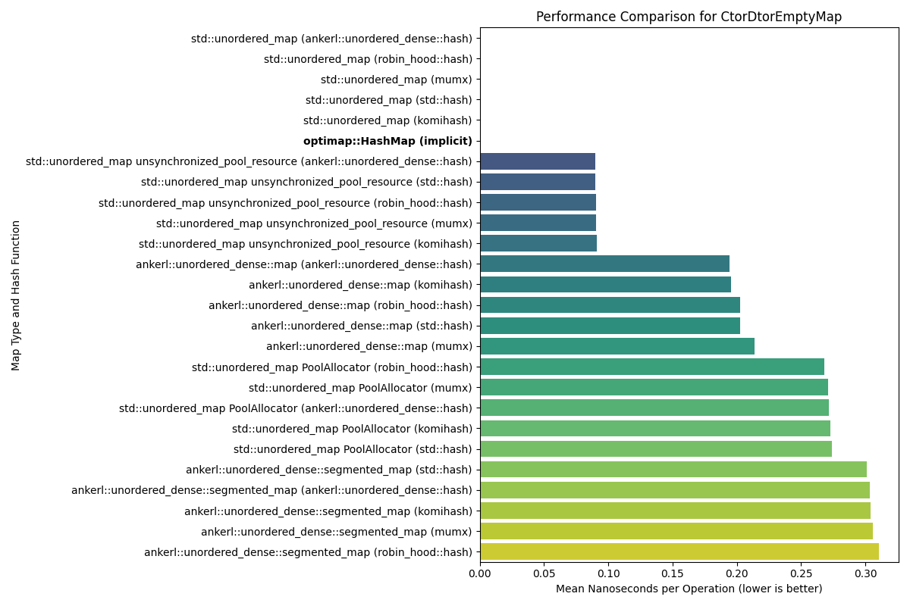
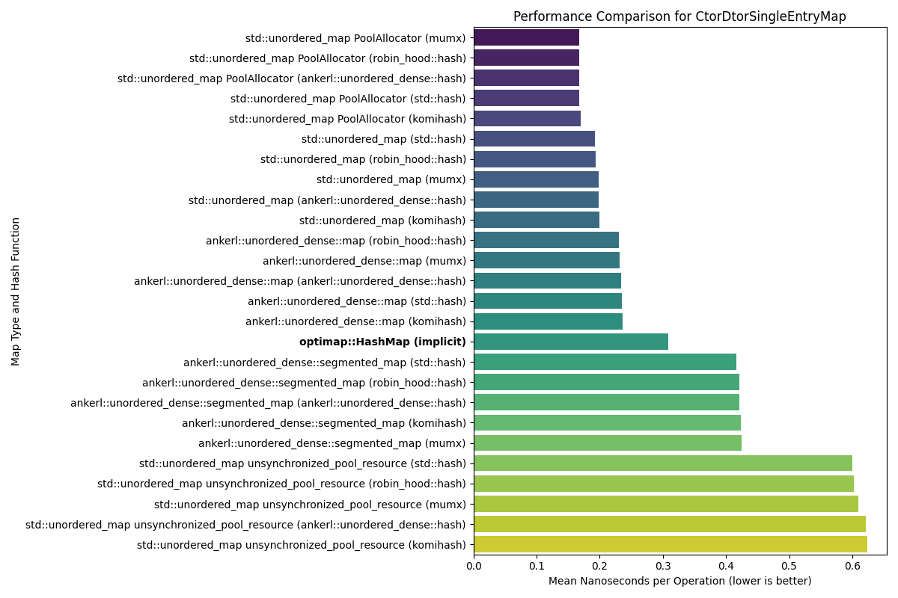
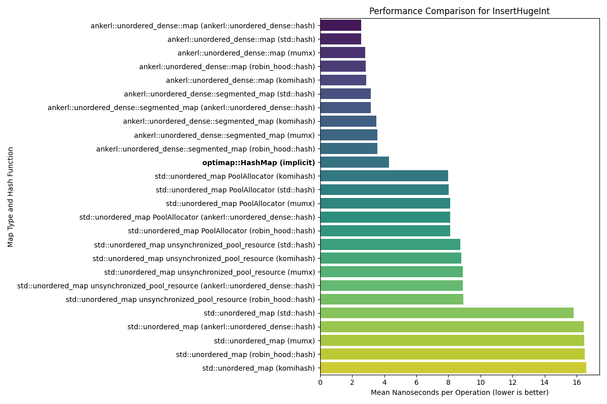
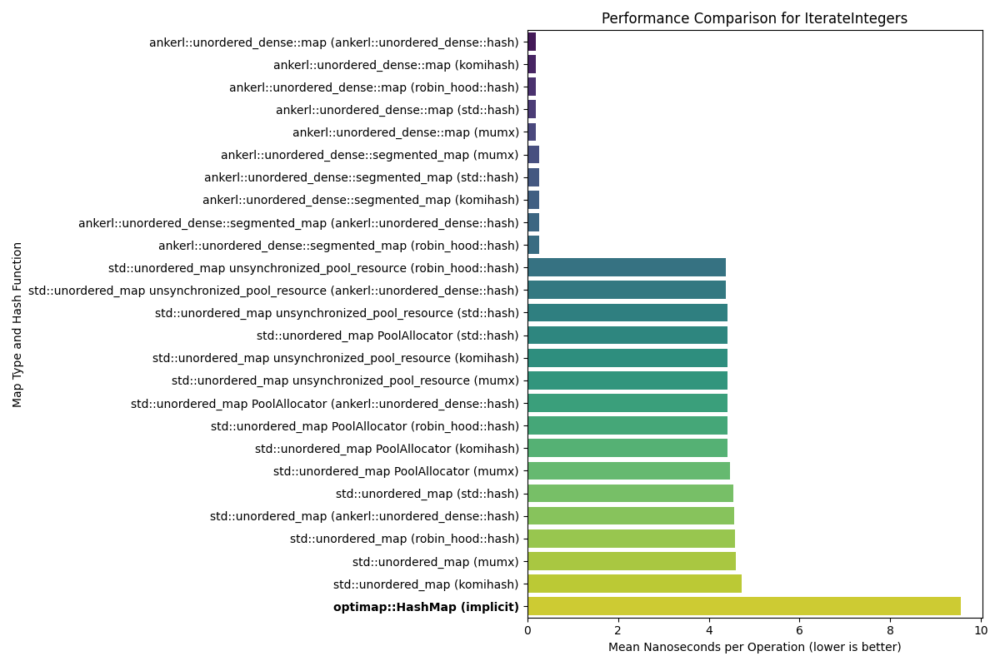
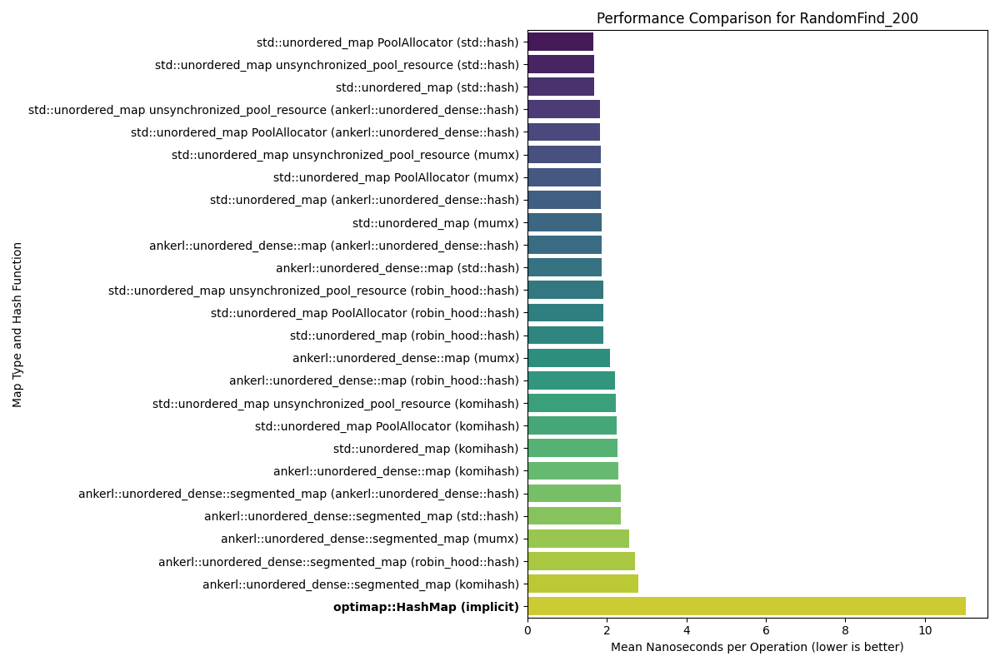

# OptimMap: A SIMD-accelerated, Cache-Optimized C++ Hash Map

`optimap` is a high-performance, open-addressing, general-purpose hash map for C++ that implements the [Swiss Table design pattern](https://abseil.io/about/design/swisstables). It leverages a memory layout friendly to modern CPUs and SIMD instructions for accelerated lookups.

This document details design choices, performance optimizations, and lessons learned during the development of `optimap`.

### Prerequisites
- CMake $\geq$ 4.0
- A C++23-compatible compiler (I used `clang`)

## Build

### Main Build

```bash
mkdir build && cd build
cmake ..
make
```

### Run Tests

`Main Build` then...
```bash
ctest -V
```

## Benchmarks
Here lie the performance and memory usage benchmark plots for OptiMap compared to `std::unordered_map` and `ankerl::unordered_dense::map`. `std::unordered_map` and `ankerl::unordered_dense::map` use various hash functions while OptiMap uses its own proprietary hash function.

Most of the benchmarks are taken from [this repo](https://github.com/martinus/map_benchmark/tree/master/src/benchmarks), which I found from [this article](https://martin.ankerl.com/2022/08/27/hashmap-bench-01/).

### Highlights

*   **Memory Efficiency:** `OptiMap` rivals top hash maps in memory usage at scale.

*   **Performance Gains Over `std::unordered_map`:** `OptiMap` is nearly *4 times* faster than `std::unordered_map` across a wide range of large-scale operations, including insertion, deletion, and copying.

    * I am aware that `std::unordered_map` is not very performant in the context of bespoke unordered maps like `ankerl`, [`google::dense_hash_map`](https://goog-sparsehash.sourceforge.net/doc/dense_hash_map.html), or [any of the others](https://martin.ankerl.com/2022/08/27/hashmap-bench-01/#benchmark-results-table), but this is a good standard for establishing a widely-understood performance baseline

*   **Fast `clear()` Operation:** Clearing a map with 100 million elements takes just **~17 milliseconds** with `OptiMap`, magnitudes faster than `std::unordered_map`'s ~13 seconds and competitive with `ankerl`'s ~4 milliseconds.

*   **Instantaneous Construction & Destruction:** Creating and destroying empty maps is a zero-cost abstraction in `OptiMap`, registering 0 time and 0 memory overhead, matching the behavior of `std::unordered_map`.

Peruse the performance plots below by clicking the dropdowns.

<table>
<tr>
<td valign="top">
<details>
<summary><strong>Performance Plots</strong></summary>
<br>
<em>Speed of various operations. Lower is better.</em>
<div align="center">

**Copy Performance**
<br>


**CtorDtorEmptyMap Performance**
<br>


**CtorDtorSingleEntryMap Performance**
<br>


**InsertHugeInt Performance**
<br>


**IterateIntegers Performance**
<br>


**RandomDistinct2 Performance**
<br>


**RandomFind 200 Performance**
<br>


**RandomFind 2000 Performance**
<br>


**RandomFind 500000 Performance**
<br>


**RandomFindString 1000000 Performance**
<br>


**RandomFindString Performance**
<br>


</div>
</details>
</td>
<td valign="top">
<details>
<summary><strong>Memory Usage Plots</strong></summary>
<br>
<em>Memory consumption for various operations. Lower is better.</em>
<div align="center">

**Copy Memory**
<br>


**CtorDtorEmptyMap Memory**
<br>


**CtorDtorSingleEntryMap Memory**
<br>


**InsertHugeInt Memory**
<br>


**IterateIntegers Memory**
<br>


**RandomDistinct2 Memory**
<br>


**RandomFind 200 Memory**
<br>


**RandomFind 2000 Memory**
<br>


**RandomFind 500000 Memory**
<br>


**RandomFindString 1000000 Memory**
<br>


**RandomFindString Memory**
<br>


</div>
</details>
</td>
</tr>
</table>


## Concept & Architecture

[Data-oriented design principles](https://en.wikipedia.org/wiki/Data-oriented_design) are used to minimize cache misses and minimize CPU instruction throughput.

<!-- go into more technical depth on the swiss table design -->
-   **Open-Addressing with Swiss Table Design**: `optimap` is an open-addressing hash map that uses linear probing. It is based on the "Swiss Table" design, which is renowned for its performance. This approach avoids the pointer chasing inherent in chaining-based maps, resulting in a more predictable and efficient memory access pattern.

-   **Custom High-Performance Hash Function**: [Oliver Giniaux](https://ogxd.github.io/) wrote [the original implementation](https://github.com/ogxd/gxhash) in Rust. I wrote it in C++.`gxhash` features a hardware-accelerated path using [AES-NI CPU instructions](https://en.wikipedia.org/wiki/AES_instruction_set), ensuring fast hash generation that minimizes collisions.

## Differentiators & Performance Optimizations

This section details the specific techniques that give `optimap` its performance edge.

### SIMD-Accelerated Probing

The most significant optimization is the use of SIMD (Single Instruction, Multiple Data) instructions to accelerate the search for a key.

-   **16-Slot Groups**: The map processes slots in groups of 16. This number is chosen because it matches the width of a 128-bit SSE register, allowing the CPU to operate on 16-slot metadata chunks in parallel.

-   **Control Byte Metadata**: A separate `int8_t` control byte array stores metadata for each slot. Instead of storing full hashes or pointers, each byte holds either a special value (for `empty` and `deleted` states) or a 7-bit fragment of the key's full hash (`h2`).

-   **Parallel Probing with SSE2**: During a lookup, the map loads 16 control bytes into an SSE register. It then uses a single `_mm_cmpeq_epi8` instruction to compare these 16 bytes against the target hash fragment. The result is converted into a bitmask using `_mm_movemask_epi8`. This allows us to find all potential key matches within a 16-slot group in just a few CPU cycles, dramatically speeding up the probe sequence. A non-SIMD fallback implementation is provided for broader compatibility.

### Cache-Friendly Memory Layout

`optimap`'s memory layout is meticulously designed to maximize data locality and minimize CPU cache misses.

-   **Single Contiguous Allocation**: The control bytes, key-value buckets, and an iteration acceleration mask are all allocated in **one contiguous block of memory**. This ensures that related data is physically close, improving the chances it will be loaded into the cache together.

-   **Cache-Line Alignment**: The entire memory block is aligned to a **64-byte cache line boundary**. This is critical because it prevents a 16-byte group of control bytes from being split across two cache lines, which would stall the CPU and degrade SIMD performance.

### Optimized Iteration for Sparse Maps

Iterating over a hash map can be slow if it's sparsely populated. `optimap` includes a mechanism to make this fast.

-   **`group_mask` Bitmask**: A `uint64_t` bitmask is maintained where each bit corresponds to a 16-slot group. A bit is set if its corresponding group contains at least one element.

-   **Skipping Empty Groups**: The iterator uses this mask to skip entire empty groups in a single check. It finds the next non-empty group by using efficient intrinsics like `__builtin_ctzll` (count trailing zeros) to find the next set bit in the mask. This makes iteration over sparse maps significantly faster than a simple linear scan.

### gxhash: Hardware-Accelerated Hashing

The performance of a hash map is fundamentally limited by its hash function. [Oliver Giniaux](https://ogxd.github.io/) wrote [the original implementation](https://github.com/ogxd/gxhash) in Rust. I wrote it in C++.

-   **AES-NI Accelerated Path**: `gxhash` features a fast path that leverages AES-NI CPU instructions for hashing. This instruction set is designed for cryptography but can be repurposed to create an extremely fast and high-quality hash function, significantly outperforming traditional multiplication-and-rotation-based algorithms.

-   **Runtime CPU Feature Detection**: To ensure portability, `gxhash` performs runtime CPU feature detection. It checks if the user's hardware supports AES-NI and chooses the optimal code path at runtime, ensuring maximum performance when available and falling back to a portable implementation otherwise.

## What I Learned

This project was a deep dive into performance engineering and low-level optimization. The key takeaways are framed by the technical features implemented.

-   **The Power of Data-Oriented Design**: I learned that how you structure data is often more important for performance than elegant class hierarchies. Separating the "hot" control bytes from the "cold" key-value pairs was the key insight that enabled massive SIMD speedups.

-   **Practical SIMD Programming**: I gained hands-on experience with x86 intrinsics to solve a real-world problem. The `_mm_cmpeq_epi8` and `_mm_movemask_epi8` pattern is a fundamental technique in high-performance computing, and implementing it provided a concrete understanding of its power.

-   **Low-Level Memory Management**: I came to appreciate the profound performance impact of memory alignment and data locality. Writing a custom aligned allocator and managing a single memory block for the entire data structure was a crucial learning experience that demonstrated how to minimize the overhead of memory access.

-   **Advanced Bit Manipulation**: I realized the incredible efficiency of using bitmasks and bit-twiddling hacks. These techniques were used for managing group state (`group_mask`), iterating through SIMD results (`BitMask` struct), and quickly finding the next element, reinforcing that performance often comes from clever, low-level thinking.

-   **CPU-Specific Optimizations**: I learned how to write modern C++ code that adapts to the user's hardware. By checking for CPU features like AES-NI at runtime, it's possible to unlock maximum performance when available while maintaining portability for systems without those features.
