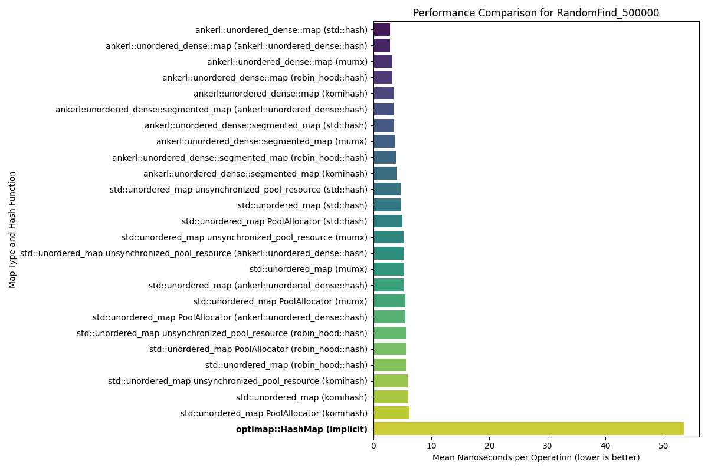
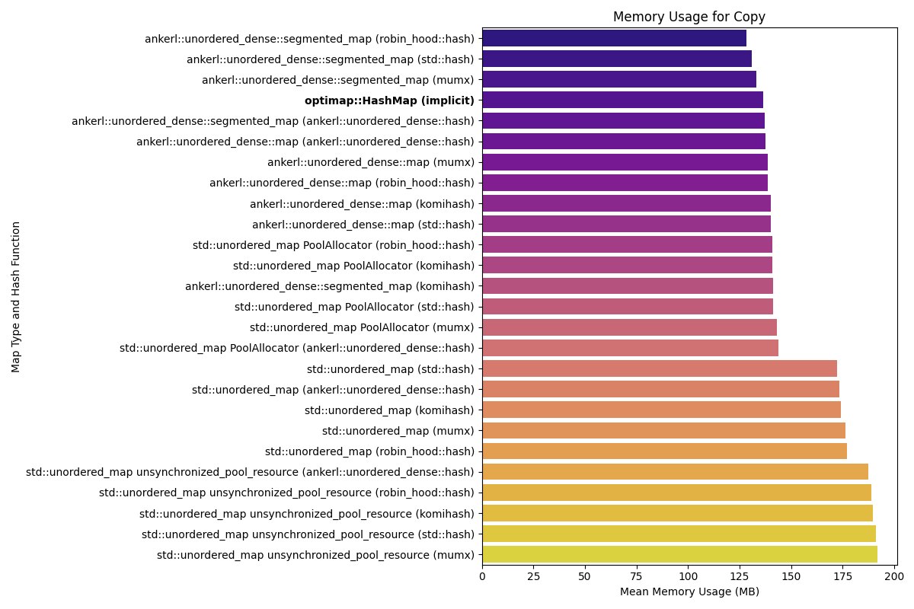
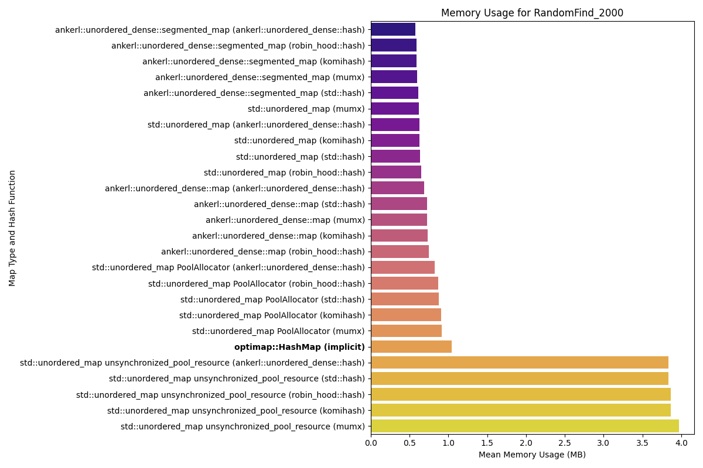
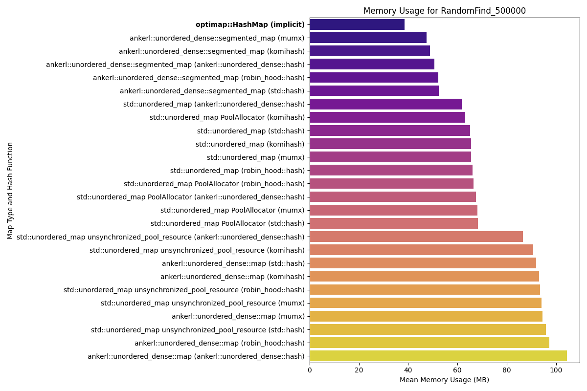

# OptimMap: A SIMD-accelerated, Cache-Optimized C++ Hash Map

`optimap` is a high-performance, open-addressing, general-purpose hash map for C++ that implements the [Swiss Table design pattern](https://abseil.io/about/design/swisstables). It leverages a memory layout friendly to modern CPUs and SIMD instructions for accelerated lookups.

This document details design choices, performance optimizations, and lessons learned during the development of `optimap`.

### Prerequisites
- CMake $\geq$ 4.0
- A C++23-compatible compiler (I used `clang`)

## Build

### Main Build

```bash
mkdir build && cd build
cmake ..
make
```

### Run Tests

`Main Build` then...
```bash
ctest -V
```

## Benchmarks
Here lie the performance and memory usage benchmark plots for OptiMap compared to `std::unordered_map` and `ankerl::unordered_dense::map`. `std::unordered_map` and `ankerl::unordered_dense::map` use various hash functions while OptiMap uses its own proprietary hash function.

Most of the benchmarks are taken from [this repo](https://github.com/martinus/map_benchmark/tree/master/src/benchmarks), which I found from [this article](https://martin.ankerl.com/2022/08/27/hashmap-bench-01/).

### Highlights

*   **Memory Efficiency:** `OptiMap` rivals top hash maps in memory usage at scale.

*   **Performance Gains Over `std::unordered_map`:** `OptiMap` is nearly *4 times* faster than `std::unordered_map` across a wide range of large-scale operations, including insertion, deletion, and copying.

    * I am aware that `std::unordered_map` is not very performant in the context of bespoke unordered maps like `ankerl`, [`google::dense_hash_map`](https://goog-sparsehash.sourceforge.net/doc/dense_hash_map.html), or [any of the others](https://martin.ankerl.com/2022/08/27/hashmap-bench-01/#benchmark-results-table), but this is a good standard for establishing a widely-understood performance baseline

*   **Fast `clear()` Operation:** Clearing a map with 100 million elements takes just **~17 milliseconds** with `OptiMap`, magnitudes faster than `std::unordered_map`'s ~13 seconds and competitive with `ankerl`'s ~4 milliseconds.

*   **Instantaneous Construction & Destruction:** Creating and destroying empty maps is a zero-cost abstraction in `OptiMap`, registering 0 time and 0 memory overhead, matching the behavior of `std::unordered_map`.

Peruse the performance plots below by clicking the dropdowns.

<table>
<tr>
<td valign="top">
<details>
<summary><strong>Performance Plots</strong></summary>
<br>
<em>Speed of various operations. Lower is better.</em>
<div align="center">

**Copy Performance**
<br>


**CtorDtorEmptyMap Performance**
<br>


**CtorDtorSingleEntryMap Performance**
<br>


**InsertHugeInt Performance**
<br>


**IterateIntegers Performance**
<br>


**RandomDistinct2 Performance**
<br>


**RandomFind 200 Performance**
<br>


**RandomFind 2000 Performance**
<br>


**RandomFind 500000 Performance**
<br>


**RandomFindString 1000000 Performance**
<br>


**RandomFindString Performance**
<br>


</div>
</details>
</td>
<td valign="top">
<details>
<summary><strong>Memory Usage Plots</strong></summary>
<br>
<em>Memory consumption for various operations. Lower is better.</em>
<div align="center">

**Copy Memory**
<br>


**CtorDtorEmptyMap Memory**
<br>


**CtorDtorSingleEntryMap Memory**
<br>


**InsertHugeInt Memory**
<br>


**IterateIntegers Memory**
<br>


**RandomDistinct2 Memory**
<br>


**RandomFind 200 Memory**
<br>


**RandomFind 2000 Memory**
<br>


**RandomFind 500000 Memory**
<br>


**RandomFindString 1000000 Memory**
<br>


**RandomFindString Memory**
<br>


</div>
</details>
</td>
</tr>
</table>

## Architecture & Design

`optimap` is an open-addressing hash map engineered from first principles of [data-oriented design](https://en.wikipedia.org/wiki/Data-oriented_design). The architecture prioritizes CPU cache efficiency and instruction-level parallelism to achieve maximum throughput. Every design choice is intended to minimize cache misses, reduce branch mispredictions, and leverage modern CPU features like [`SIMD`](https://en.wikipedia.org/wiki/Single_instruction,_multiple_data) and [`AES-NI`](https://en.wikipedia.org/wiki/AES_instruction_set).

The core of `optimap` is a C++ implementation of the [Swiss Table design](https://abseil.io/about/design/swisstables), which decouples slot metadata from the key-value entries. This separation allows the algorithm to operate on a compact, cache-friendly metadata array for most of a probe sequence, deferring expensive access to the main bucket array until a potential match is identified. I defer further technical detail about the Swiss Table structure to [this link](https://abseil.io/about/design/swisstables). [This](https://github.com/google/cwisstable) is the repo of the original implementation. It is interesting. You should read it.


## Core Mechanics & Performance Optimizations

### SIMD-Accelerated Swiss Table Probing

The lookup process is heavily optimized via SIMD instructions; it processes 16 slots in parallel instead linear probing naively.

* Decoupled Metadata Array (`m_ctrl`): The map maintains a contiguous `int8_t` array where each byte corresponds to a slot in the main bucket array. This array is cache-friendly; a single 64-byte cache line holds the metadata for 64 slots.

* `H1`/`H2` Hash Partitioning: A 64-bit hash is partitioned into two components:
    * `H1` (Lower): Determines the starting group index for a probe sequence (hash & (capacity - 1))
    * `H2` (Upper): A "fingerprint" of the hash stored in the metadata array. The $8^{th}$ bit (MSb) is reserved as a state flag, where a `1` indicates an EMPTY (`0b10000000`) or DELETED (`0b11111110`) slot. `0` indicates a FULL slot.

* Parallel Lookup with `SSE2`: The probing mechanism is executed with `SSE2` intrinsics:
    * A 16-byte chunk of the metadata array is loaded into a [`__m128i`](https://learn.microsoft.com/en-us/cpp/cpp/m128i?view=msvc-170) register.
    * The target `H2` fingerprint is broadcast across another `__m128i` register using [`_mm_set1_epi8`](https://www.cs.virginia.edu/~cr4bd/3330/S2018/simdref.html).
    * A single `_mm_cmpeq_epi8` instruction performs a parallel byte-wise comparison, identifying all slots in the group that match the `H2` fingerprint.
    * The 128-bit result is compacted into a 16-bit bitmask via `_mm_movemask_epi8`.

If this bitmask is non-zero, it signifies one or more potential matches. The algorithm then uses a bit-scan intrinsic ([`__builtin_ctz`](https://gcc.gnu.org/onlinedocs/gcc/Bit-Operation-Builtins.html) or [`_BitScanForward`](https://learn.microsoft.com/en-us/cpp/intrinsics/bitscanforward-bitscanforward64?view=msvc-170)) to identify the index of each potential match. Then the more expensive full-key comparison is performed by accessing the main bucket array. This strategy filters out the majority of non-matching slots using a few, efficient CPU instructions.

### Memory Layout and Data Locality

To complement the SIMD-friendly algorithm, the memory layout is optimized to prevent pipeline stalls and maximize data locality.

* Contiguous Allocation: The m_ctrl metadata, m_buckets key-value entries, and an iteration acceleration mask (m_group_mask) are all allocated in a single, contiguous memory block. This reduces allocation overhead and ensures that all components of the hash map are physically co-located, maximizing the utility of the CPU's prefetcher.
* Cache-Line Alignment: The entire block is aligned to a 64-byte boundary. This guarantees that a 16-byte metadata group can never be split across two cache lines—a critical optimization that prevents alignment-related stalls during SIMD load operations.


### gxhash: Hardware-Accelerated Hashing

[Oliver Giniaux](https://ogxd.github.io/) wrote [the original implementation](https://github.com/ogxd/gxhash) in Rust. I wrote it in C++.`gxhash` features a hardware-accelerated path using [AES-NI CPU instructions](https://en.wikipedia.org/wiki/AES_instruction_set), ensuring fast hash generation that minimizes collisions.

* AES-NI Instruction Set: gxhash leverages the AES instruction set (AES-NI), which is hardware support for AES encryption and decryption available on most modern x86 CPUs. These instructions can be repurposed to create a powerful permutation and diffusion function for hashing. An AES round is effectively a high-quality, hardware-accelerated mixing function that is significantly faster than traditional integer multiplication and bit-rotation operations.
* Runtime CPU Dispatching: To maintain portability, gxhash performs runtime feature detection. It queries the CPU to determine if AES-NI is supported and dispatches to the hardware-accelerated implementation if available. Otherwise, it falls back to a portable, albeit slower, hashing algorithm.

### Accelerated Iteration Over Sparse Maps

A common performance pitfall in hash maps is slow iteration when the map is sparsely populated. optimap mitigates this with an iteration acceleration structure.

* Group Occupancy Bitmask (m_group_mask): A uint64_t bitmask is maintained where each bit corresponds to a 16-slot group. A bit is set to 1 if its group contains at least one FULL slot.
* Efficiently Skipping Empty Space: During iteration, instead of checking every slot, the iterator first consults this bitmask. It can process 64 groups at a time by checking a single uint64_t. If a word in the mask is zero, all 64 corresponding groups (1024 slots) are skipped. If it is non-zero, a bit-scan intrinsic (__builtin_ctzll) is used to instantly find the index of the next non-empty group. This turns iteration over large, empty regions of the map into a near-constant-time operation.

## What I Learned

This project was a deep dive into performance engineering and low-level optimization. The key takeaways are framed by the technical features implemented.

-   **The Power of Data-Oriented Design**: I learned that how you structure data is often more important for performance than elegant class hierarchies. Separating the "hot" control bytes from the "cold" key-value pairs was the key insight that enabled massive SIMD speedups.

-   **Practical SIMD Programming**: I gained hands-on experience with x86 intrinsics to solve a real-world problem. The `_mm_cmpeq_epi8` and `_mm_movemask_epi8` pattern is a fundamental technique in high-performance computing, and implementing it provided a concrete understanding of its power.

-   **Low-Level Memory Management**: I came to appreciate the profound performance impact of memory alignment and data locality. Writing a custom aligned allocator and managing a single memory block for the entire data structure was a crucial learning experience that demonstrated how to minimize the overhead of memory access.

-   **Advanced Bit Manipulation**: I realized the incredible efficiency of using bitmasks and bit-twiddling hacks. These techniques were used for managing group state (`group_mask`), iterating through SIMD results (`BitMask` struct), and quickly finding the next element, reinforcing that performance often comes from clever, low-level thinking.

-   **CPU-Specific Optimizations**: I learned how to write modern C++ code that adapts to the user's hardware. By checking for CPU features like AES-NI at runtime, it's possible to unlock maximum performance when available while maintaining portability for systems without those features.
