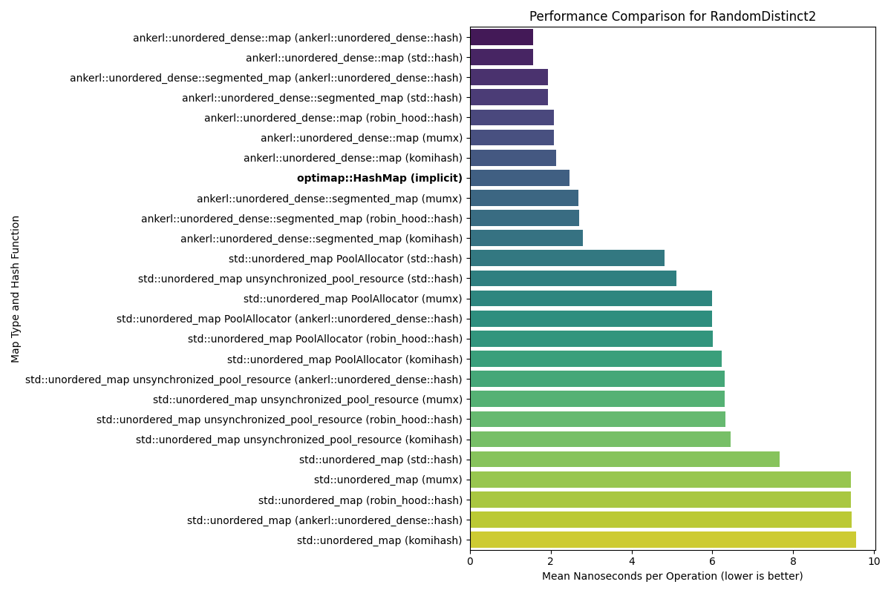
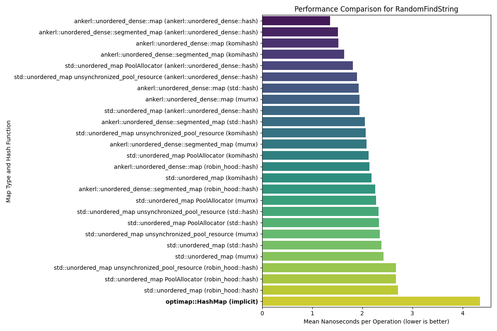
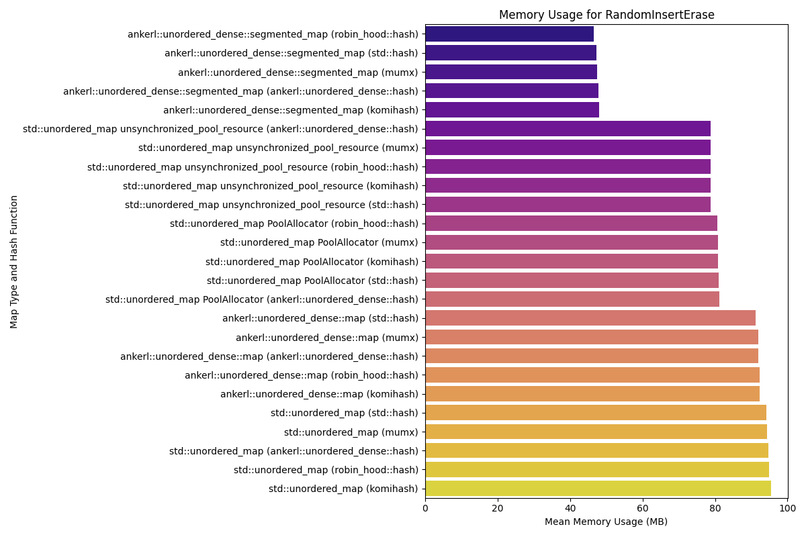
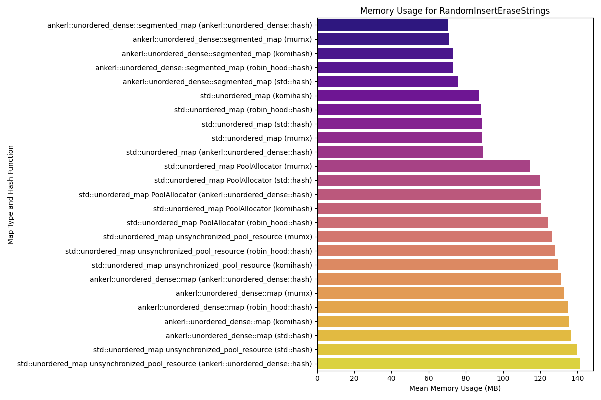

# OptiMap
Cache-aware C++ map optimized for speed and efficiency.

### Prerequisites
- CMake 4.0 or higher
- A C++23 compatible compiler

## Benchmarks
Here are the performance and memory usage benchmarks for OptiMap compared to `std::unordered_map` and `ankerl::unordered_dense::map`. `std::unordered_map` and `ankerl::unordered_dense::map` use various hash functions while OptiMap uses its own proprietary hash function.

<table>
<tr>
<td valign="top">
<details>
<summary><strong>Performance Results</strong></summary>
<br>
<em>Speed of various operations. Lower is better.</em>
<div align="center">

**Copy Performance**
<br>


**CtorDtorEmptyMap Performance**
<br>


**CtorDtorSingleEntryMap Performance**
<br>


**InsertHugeInt Performance**
<br>


**IterateIntegers Performance**
<br>


**RandomDistinct2 Performance**
<br>


**RandomFind 200 Performance**
<br>


**RandomFind 2000 Performance**
<br>


**RandomFind 500000 Performance**
<br>


**RandomFindString 1000000 Performance**
<br>


**RandomFindString Performance**
<br>


**RandomInsertErase Performance**
<br>


**RandomInsertEraseStrings Performance**
<br>


</div>
</details>
</td>
<td valign="top">
<details>
<summary><strong>Memory Usage</strong></summary>
<br>
<em>Memory consumption for various operations. Lower is better.</em>
<div align="center">

**Copy Memory**
<br>


**CtorDtorEmptyMap Memory**
<br>


**CtorDtorSingleEntryMap Memory**
<br>


**InsertHugeInt Memory**
<br>


**IterateIntegers Memory**
<br>


**RandomDistinct2 Memory**
<br>


**RandomFind 200 Memory**
<br>


**RandomFind 2000 Memory**
<br>


**RandomFind 500000 Memory**
<br>


**RandomFindString 1000000 Memory**
<br>


**RandomFindString Memory**
<br>


**RandomInsertErase Memory**
<br>


**RandomInsertEraseStrings Memory**
<br>


</div>
</details>
</td>
</tr>
</table>

### Running Benchmarks

```bash
# Build the project
mkdir build && cd build
cmake ..
make

# Run benchmarks
./OptiMapBenchmarks
```
